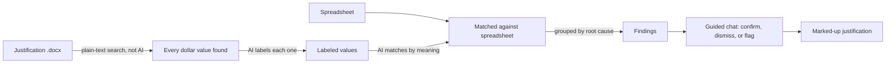
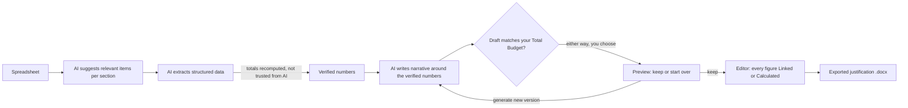

# Just-In-Time

A lightweight, client-side budget justification generator and verifier for research administrators. No backend, no build step — hosted on GitHub Pages.

## Features

### Projects
- Every generation and verification happens inside a Project — create one on first load, and switch between projects anytime from the "Switch Project" link in the tab bar.
- A project remembers its spreadsheet, template type, profile, Total Budget figure, and in-progress draft, so you can leave and come back later.
- Projects are stored entirely in your browser (IndexedDB) — nothing is uploaded to a server.

### Verifier
- Upload a budget justification (`.docx`) and its spreadsheet (`.csv`/`.xls`/`.xlsx`) to catch mismatches before you submit.
- AI labels every dollar value, matches it against the spreadsheet, and groups discrepancies by root cause.
- A guided chat walks you through each finding — confirm it, explain it away, click "Ignore Issue" to skip it, or click "Flag Issue" to mark it as a confirmed issue without discussion.
- The justification and spreadsheet are shown side-by-side with the chat, with flagged values highlighted and auto-tracked as you go.
- Ends with a plain-language summary and a downloadable marked-up copy of the justification with flagged values highlighted.
- "Try it out!" at the end of the walkthrough launches a guided, sample-document run-through of the whole Verifier flow, with on-screen arrows pointing to what to click next. Exit it at any time.
- If the active project already has a spreadsheet on file, reuse it with one click instead of uploading it again.

### Generator
- A 3-phase flow: Generate a first draft, Validate it against your spreadsheet's Total Budget, then Edit it in an interactive canvas before exporting.
- Upload a budget spreadsheet and project summary, and enter the Total Budget figure from your spreadsheet, to get a formatted `.docx` justification back.
- Choose a Grant Template Type — National Science Foundation or General grants.gov, each with its own section layout.
- Institutional Profiles store your fringe/F&A boilerplate so the AI weaves institution-specific language into the narrative.
- Before extracting each section, the AI first suggests which items belong in it based on the budget spreadsheet, then those suggestions steer the real extraction toward what's actually relevant — visible in each section's "Details" log. Skipped for Fringe Benefits and Indirect Costs.
- Each section is generated in two passes — verified data extraction, then narrative writing — with the numbers automatically reconciled so the writing pass can't quietly change a figure.
- Every line item's total is recalculated from its own year-by-year breakdown rather than trusted as extracted, so a multi-year item (e.g. a recurring trip) can't be undercounted — unless no yearly breakdown was returned for it, in which case the extracted total is kept as-is and flagged rather than zeroed out.
- Travel line items break down into itemized cost components (Airfare, Mileage, Lodging, Per Diem, Registration, Other) with a computed subtotal, when the budget spreadsheet itemizes them.
- Items in the generic "Other" category are automatically checked against every other budget category and dropped if they appear to be the same expense counted twice.
- Before you commit to a draft, its total is checked against your Total Budget — keep the version or generate a new one from scratch, either way.
- Once kept, every dollar figure is either **Linked** to a spreadsheet cell or **Calculated** as a sum of other values — click any figure to relink it, edit its formula, or see where it came from.
- Re-upload an updated spreadsheet at any point while editing — linked values update automatically, and the app tries to recover links on its own if rows were inserted or removed, flagging any it can't reconnect.
- Template Mode produces a structured draft with placeholder text instead of full AI-written narrative.
- Categories and sub-sections with no budgeted items skip their "total request" sentence and headers instead of showing a $0 placeholder.
- Export to `.docx` whenever you're ready, and again as many times as you like as you keep editing.

### Shared
- Drag-and-drop uploads, an animated multi-stage progress sequence for both generating and verifying (full technical log available via "Show details"/"Expand Analysis Details"), and a "How It Works" walkthrough for first-time users.
- The Generator tab is the leftmost tab in the nav bar, and opens by default.
- API keys are stored only in your browser's `localStorage` — a warning reminds you to check your key's data-sharing terms before use.

## How It Works

Both tools follow the same underlying strategy: numbers come from a deterministic source (the spreadsheet, or plain text matching), and AI is only ever trusted to label, match, or write around those numbers — never to originate or silently change them.

### Verifier: trust the spreadsheet, question the writing



- Dollar values are found by searching the document's text, not by asking AI — so nothing gets invented or missed.
- AI only labels what each value means and matches it to the spreadsheet; it never rules on right or wrong by itself.
- Every mismatch becomes a finding you resolve yourself in the chat — nothing is silently auto-corrected.

### Generator: the spreadsheet is the only source of truth



- Every figure in the draft is recomputed from the spreadsheet, never taken on faith from the AI.
- The AI writes narrative language around numbers that are already locked in — a draft that changes a number gets rejected and rewritten.
- Before you commit to a draft, its total is checked against the Total Budget you entered — you decide whether to keep it or start over, pass or fail.
- Once kept, every dollar figure is traceable — Linked to the spreadsheet cell it came from, or Calculated as a sum of other figures — right up until you export.

## Tech Stack

| Concern | Library |
|---|---|
| Spreadsheet parsing | [SheetJS](https://sheetjs.com/) |
| Word document parsing | [Mammoth.js](https://github.com/mwilliamson/mammoth.js) |
| AI generation | [Gemini API](https://ai.google.dev/) (structured JSON output) |
| Word document generation | [docx](https://github.com/dolanmiu/docx) (built programmatically) |
| Verifier progress animation | [anime.js](https://animejs.com/) (CDN) |
| Settings & review-chat persistence | Browser `localStorage` |
| Project storage (spreadsheets, drafts, edit state) | Browser `IndexedDB` |

## File Structure

```
justintime/
├── index.html              # SPA shell
├── css/
│   └── styles.css
├── js/
│   ├── app.js              # Boot, tab routing, project-aware wiring
│   ├── project-store.js    # IndexedDB CRUD for Projects
│   ├── project-picker.js   # Projects screen: create/rename/delete/open
│   ├── settings.js         # Settings tab + localStorage CRUD
│   ├── generator.js        # Generator workflow orchestration (Generate → Validate → Edit)
│   ├── parser.js           # SheetJS parsing: CSV text + per-cell sheet data for linking
│   ├── value-graph.js      # Classifies every dollar figure as Linked or Calculated; recomputes on edit
│   ├── layout-builder.js   # Builds a renderer-agnostic outline of a draft for the editor
│   ├── editor-canvas.js    # Phase 3 interactive editor: linking, formulas, export
│   ├── validation-checkpoint.js # Phase 2 pass/fail checkpoint against your Total Budget
│   ├── api.js              # Universal API adapter: Gemini direct (standalone) or Vandalizer proxy (DGX-hosted)
│   ├── schemas.js          # Full JSON schemas per template type + VerifierSchemas
│   ├── sections.js         # Section registry: ordered section definitions per template
│   ├── verifier.js         # Portable two-step verification core: Verifier.run(text, csv, key)
│   ├── verifier-tab.js     # Verifier tab UI: file handling, orchestration, results rendering
│   ├── verify-anim.js      # Animated scan/label/match/audit/summarize progress sequence
│   ├── verifier-chat.js    # Chat-driven findings review, persists/resumes via localStorage
│   ├── highlighter.js      # DOCX markup: injects <w:highlight> into flagged runs via JSZip
│   ├── doc-preview.js      # Live in-browser justification preview
│   ├── sheet-preview.js    # Live in-browser spreadsheet preview
│   ├── document.js         # docx output + download trigger
│   └── try-it-tutorial.js  # Guided "Try it out!" sample-document walkthrough
├── templates/
│   ├── nsf.txt             # Reference: NSF section layout and field definitions
│   └── general.txt         # Reference: General grants.gov section layout and field definitions
└── examples/                # Sample justification + spreadsheet used by "Try it out!"
```

## Getting Started: Obtaining a Gemini API Key

> **DGX / Vandalizer deployments:** AI calls route through the `/api/apps/generate` proxy automatically. No Gemini API key needed. If your Vandalizer session expires mid-use, it's refreshed automatically and the request retries — no reload needed.

Just-In-Time uses the Gemini API when running standalone. A free key is available through Google AI Studio — no billing required for standard use.

**Get a key:**
1. Go to [aistudio.google.com](https://aistudio.google.com/) and sign in with any Google account.
2. Click **Get API key** in the sidebar, then **Create API key**.
3. Copy the generated string.

> **Security note:** Treat this key like a password. Never commit it to a public repository.

**Configure it in Just-In-Time:**
- **UI (recommended):** Settings tab → paste into **Gemini API Key** → **Save API Key**. Stored in `localStorage`, never leaves your device.
- **Environment variable** (local backend use): add `GEMINI_API_KEY=your_actual_api_key_here` to a `.env` file in the project root.

## Local Development

No build step. Open `index.html` directly, or serve the directory:

```bash
npx serve .
```

## Deployment

Push to `main` — GitHub Pages serves `index.html` from the repository root automatically.

## Usage

### Working with Projects
1. On load, choose an existing project or click **+ New Project**.
2. Opening a project reveals the Generator and Verifier tabs, scoped to that project's files and draft.
3. Click **Switch Project** in the tab bar at any time to return to the project list.

### Verifying a budget justification
1. Go to the **Verifier** tab.
2. Upload a budget justification `.docx` and its spreadsheet — or reuse the active project's spreadsheet with one click.
3. Click **Verify Budget**.
4. Work through the chat that opens for each flagged finding — confirm, dismiss, or ignore it.
5. Review the summary and download the marked-up document.

See [How It Works](#how-it-works) for the strategy behind the findings.

### Generating a budget justification
1. Go to the **Settings** tab, enter and save your Gemini API key.
2. Create at least one Institutional Profile with your fringe/F&A boilerplate.
3. Go to the **Generator** tab, select a profile, upload your budget file, and enter its Total Budget.
4. Upload your project summary and click **Generate Justification**.
5. Review the draft against your Total Budget, then **Keep This Version** or **Generate New Version**.
6. In the editor, link or relink figures to spreadsheet cells, build calculated values, and edit the narrative directly.
7. Click **Export to .docx** whenever you're ready — export again anytime as you keep editing.
