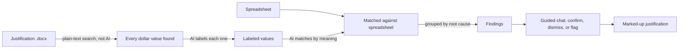
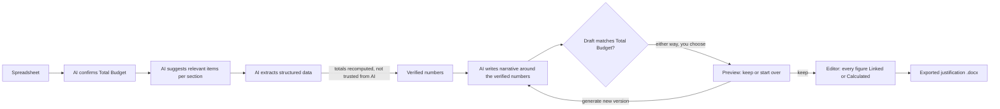

# Just-In-Time


A lightweight, client-side budget justification generator and verifier for research administrators. No backend, no build step — hosted on GitHub Pages.

**Contents:** [Quick Start](#quick-start) · [Features](#features) · [How It Works](#how-it-works) · [Tech Stack & File Structure](#tech-stack--file-structure) · [Local Development](#local-development) · [Deployment](#deployment)

## Quick Start

1. Open `index.html` (or serve the folder — see [Local Development](#local-development)), then create or open a project.
2. Click **Settings**, save a [Gemini API key](#getting-a-gemini-api-key) (skipped automatically on Vandalizer/DGX deployments), and add an Institutional Profile with your fringe/F&A boilerplate.
3. From the project, pick a path:
   - **Generate a new draft** — on the **Generator** tab, upload a budget spreadsheet and project summary, choose a profile and template type, and click **Generate Justification**. Review the draft, keep it, then refine it in the editor.
   - **Check an existing justification** — on the **Verifier** tab, upload (or reuse) the justification and its spreadsheet, and click **Verify Budget**. Work through the guided chat for each finding.
4. New to a tab? Click the **?** button in the corner for a step-by-step walkthrough and a hands-on sample-document tour — it steps aside once you've actually used that tab in the project.

### Getting a Gemini API Key

> **DGX / Vandalizer deployments:** AI calls route through the deployment's own proxy automatically — no key needed, and an expired session refreshes itself mid-use.

1. Go to [aistudio.google.com](https://aistudio.google.com/), sign in, and click **Get API key** → **Create API key**. It's free, with no billing required for standard use.
2. Paste it into **Settings → Gemini API Key**. It's stored only in your browser's `localStorage` and never leaves your device.

> Treat the key like a password — never commit it to a public repository, and check your key's data-sharing terms before sending sensitive budget data.

## Features

### Projects
- Everything happens inside a Project, stored entirely in your browser (IndexedDB) — nothing is uploaded to a server.
- A project remembers its files, drafts, and verification history so you can leave and pick up later.
- Settings (API key, Institutional Profiles) are shared across all projects, managed from the Projects screen.

### Generator
- A 3-phase flow: generate a first draft, validate it against your spreadsheet, then edit it in an interactive canvas before exporting.
- The spreadsheet's Total Budget is confirmed automatically by AI before generation begins — you're only asked to enter it yourself if it can't.
- Numbers always come from your spreadsheet, never from AI narrative: every total is recomputed rather than trusted, and multi-year items, itemized travel costs, and duplicate "Other" expenses are reconciled automatically.
- Once a draft exists, reopen it or discard everything to start over, right from the Generator tab.
- Template Mode swaps AI narrative for placeholder text, for a purely structural draft.

### Verifier
- Checks an existing budget justification against its spreadsheet — upload both, or let the active project's files fill in automatically.
- AI labels and matches every dollar value, then groups any discrepancies by root cause.
- A guided chat walks you through each finding so you confirm, explain, or flag it yourself — nothing is auto-corrected.
- Ends in a plain-language summary and a downloadable marked-up copy of the justification.
- Past runs are saved per project and can be revisited from **Verification History**.

### The Editor
- Every dollar figure is either **Linked** to a spreadsheet cell or **Calculated** from other values — click one to see where it comes from, relink it, or edit its formula.
- Everything else, headings and labels included, is free text you can edit directly. Select any plain dollar amount and click **Set Selection as Value** to bring it under the same system.
- A banner flags any figure that couldn't be matched automatically, and re-uploading a spreadsheet keeps every linked value in sync.
- View the project's uploaded documentation alongside the spreadsheet, and export to `.docx` as many times as you like.

### Institutional Profiles
- Store your fringe/F&A boilerplate so the AI weaves institution-specific language into the narrative.
- On-premises (Vandalizer) deployments can ship a shared, read-only default profile for everyone on that install — see [`profiles/README.md`](profiles/README.md).

## How It Works

Both tools follow the same strategy: numbers come from a deterministic source — the spreadsheet, or plain-text search — and AI is only ever trusted to label, match, or write around those numbers, never to originate or silently change them.

### Verifier: trust the spreadsheet, question the writing



AI only labels and matches; it never rules on right or wrong by itself — every mismatch is a finding you resolve yourself in the chat.

### Generator: the spreadsheet is the only source of truth



The AI writes narrative language around numbers that are already locked in — a draft that changes one gets rejected and rewritten. Once kept, every figure stays traceable, Linked or Calculated, right up until export.

## Tech Stack & File Structure

<details>
<summary>Expand</summary>

| Concern | Library |
|---|---|
| Spreadsheet parsing | [SheetJS](https://sheetjs.com/) |
| Word document parsing | [Mammoth.js](https://github.com/mwilliamson/mammoth.js) |
| AI generation | [Gemini API](https://ai.google.dev/) (structured JSON output) |
| Word document generation | [docx](https://github.com/dolanmiu/docx) (built programmatically) |
| Verifier progress animation | [anime.js](https://animejs.com/) (CDN) |
| Settings & review-chat persistence | Browser `localStorage` |
| Project storage (spreadsheets, project docs, drafts, edit state) | Browser `IndexedDB` |

```
justintime/
├── index.html              # SPA shell
├── css/
│   └── styles.css
├── js/
│   ├── app.js              # Boot, tab routing, project-aware wiring
│   ├── project-store.js    # IndexedDB CRUD for Projects
│   ├── project-picker.js   # Projects screen: create/rename/delete/open, Settings view toggle
│   ├── settings.js         # Settings: API key + Institutional Profiles, local/default profile loading
│   ├── generator.js        # Generate → Validate orchestration, Total Budget check-figure extraction
│   ├── parser.js           # SheetJS parsing: CSV text + per-cell sheet data for linking
│   ├── value-graph.js      # Classifies every dollar figure as Linked or Calculated; recomputes on edit
│   ├── layout-builder.js   # Builds the editable block outline of a generated draft
│   ├── editor-canvas.js    # Interactive editor: free-text editing, linking, formulas, audit banner, export
│   ├── validation-checkpoint.js # Pass/fail checkpoint against the confirmed Total Budget
│   ├── api.js              # Universal API adapter: Gemini direct (standalone) or Vandalizer proxy (DGX-hosted)
│   ├── schemas.js          # Full JSON schemas per template type + VerifierSchemas
│   ├── sections.js         # Section registry: ordered section definitions per template
│   ├── verifier.js         # Portable two-step verification core: Verifier.run(text, csv, key)
│   ├── verifier-tab.js     # Verifier tab UI: file handling, orchestration, results, verification history
│   ├── verify-anim.js      # Animated scan/label/match/audit/summarize progress sequence
│   ├── verifier-chat.js    # Chat-driven findings review, persists/resumes via localStorage
│   ├── highlighter.js      # DOCX markup: injects <w:highlight> into flagged runs via JSZip
│   ├── doc-preview.js      # Live in-browser justification preview
│   ├── sheet-preview.js    # Live in-browser spreadsheet preview
│   ├── document.js         # Renders the editor's blocks to a .docx and triggers download
│   ├── how-it-works.js     # "How It Works" walkthrough, tab-aware
│   └── try-it-tutorial.js  # Guided "Try it out!" sample-document walkthroughs
├── templates/
│   ├── nsf.txt             # Reference: NSF section layout and field definitions
│   └── general.txt         # Reference: General grants.gov section layout and field definitions
├── profiles/                # On-prem deployments only: profiles.json supplies a shared default profile
└── examples/                # Sample files used by the "Try it out!" tours
```

</details>

## Local Development

No build step. Open `index.html` directly, or serve the directory:

```bash
npx serve .
```

## Deployment

Push to `main` — GitHub Pages serves `index.html` from the repository root automatically.
