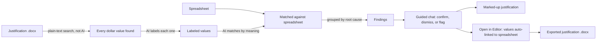
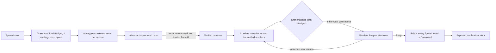

# Just-In-Time

A lightweight, client-side budget justification generator and verifier for research administrators. No backend, no build step — hosted on GitHub Pages.

## Features

### Projects
- Every generation and verification happens inside a Project — create one on first load, and return to the project list anytime with **Back to Main Menu**.
- A project remembers its spreadsheet, project documentation, template type, profile, Total Budget figure, in-progress draft, and exported justification, so you can leave and come back later.
- Projects are stored entirely in your browser (IndexedDB) — nothing is uploaded to a server.
- Settings (API key and Institutional Profiles) live on the Projects screen, via the **Settings** button — they're shared across all your projects, not scoped to one. On an on-premises (Vandalizer) deployment, the API Configuration section is hidden entirely, since AI calls route through the deployment's own proxy.

### Generator
- A 3-phase flow: Generate a first draft, Validate it, then Edit it in an interactive canvas before exporting.
- Upload a budget spreadsheet and project summary, choose a Grant Template Type (National Science Foundation or General grants.gov) and Institutional Profile, and click **Generate Justification**.
- The spreadsheet's overall Total Budget figure starts scanning the moment you upload it — two independent AI readings have to agree before it's accepted, retried up to 5 times. A resolved figure appears in place as "Total Budget: $…"; if the readings never agree, you're asked to type it in yourself instead.
- Institutional Profiles store your fringe/F&A boilerplate so the AI weaves institution-specific language into the narrative.
- Before extracting each section, the AI first suggests which items belong in it based on the budget spreadsheet, then those suggestions steer the real extraction toward what's actually relevant — visible in each section's "Details" log. Skipped for Fringe Benefits and Indirect Costs.
- Each section is generated in two passes — verified data extraction, then narrative writing — with the numbers automatically reconciled so the writing pass can't quietly change a figure.
- Every line item's total is recalculated from its own year-by-year breakdown rather than trusted as extracted, so a multi-year item (e.g. a recurring trip) can't be undercounted — unless no yearly breakdown was returned for it, in which case the extracted total is kept as-is and flagged rather than zeroed out.
- Travel line items break down into itemized cost components (Airfare, Mileage, Lodging, Per Diem, Registration, Other) with a computed subtotal, when the budget spreadsheet itemizes them.
- Items in the generic "Other" category are automatically checked against every other budget category and dropped if they appear to be the same expense counted twice.
- Before you commit to a draft, you're shown a preview and asked whether to keep it or generate a new one.
- Template Mode produces a structured draft with placeholder text instead of full AI-written narrative.
- Categories and sub-sections with no budgeted items skip their "total request" sentence and headers instead of showing a $0 placeholder.

### Verifier
- Upload a budget justification `.docx` and its spreadsheet — or reuse the active project's spreadsheet, or a justification already generated and exported in this project, each with one click — and click **Verify Budget**.
- AI labels every dollar value, matches it against the spreadsheet, and groups discrepancies by root cause.
- A guided chat walks you through each finding — confirm it, explain it away, click "Ignore Issue" to skip it, or click "Flag Issue" to mark it as a confirmed issue without discussion.
- The justification and spreadsheet are shown side-by-side with the chat, with flagged values highlighted and auto-tracked as you go.
- Ends with a plain-language summary, a downloadable marked-up copy with flagged values highlighted, and an **Open in Editor** button that imports the document into the same interactive editor the Generator uses — every dollar figure it can match to your spreadsheet becomes Linked automatically.
- "Try it out!" launches a guided, sample-document run-through of the whole review flow, with on-screen arrows pointing to what to click next. Exit it at any time.

### The Editor
However a draft arrives — generated or imported — every dollar figure is either **Linked** to a spreadsheet cell or **Calculated** as a sum of other values, and everything else is free text you can edit directly, section headers included.
- Click any figure to see where it comes from — a linked figure shows its sheet name and cell reference, a calculated one shows how many values feed into it, and looks visually distinct from the values that make it up — then relink it, edit its formula, or unlink it. Click anywhere else to close the inspector.
- While editing a calculated value's formula, clicking other figures adds or removes them from the total live, with the ones currently included highlighted and everything else dimmed.
- A banner flags any figure that couldn't be automatically matched to your spreadsheet, with one click to jump to it and link it or mark it as calculated; exporting with unresolved figures still remaining asks you to confirm first.
- A "Project Docs" tab next to the spreadsheet lets you view the project documentation you uploaded, alongside the spreadsheet itself.
- Re-upload an updated spreadsheet at any point while editing — linked values update automatically, and the app tries to recover links on its own if rows were inserted or removed, flagging any it can't reconnect.
- Export to `.docx` whenever you're ready, and again as many times as you like as you keep editing.

### Institutional Profiles
- Create Institutional Profiles from the Settings screen with your fringe/F&A boilerplate.
- On an on-premises (Vandalizer) deployment, a `profiles/profiles.json` file shipped with that deployment supplies a shared Institutional Profile visible to everyone on it — shown in Settings as read-only ("Local Default"), and used as the default profile for every user automatically, including in the Generator's profile dropdown. See `profiles/README.md`.

### Shared
- Drag-and-drop uploads, an animated multi-stage progress sequence for both generating and verifying (full technical log available via "Show details"/"Expand Analysis Details"), and a "How It Works" walkthrough for first-time users.
- API keys are stored only in your browser's `localStorage` — a warning reminds you to check your key's data-sharing terms before use.

## How It Works

Both paths follow the same underlying strategy: numbers come from a deterministic source (the spreadsheet, or plain text matching), and AI is only ever trusted to label, match, or write around those numbers — never to originate or silently change them.

### Verifier: trust the spreadsheet, question the writing



- Dollar values are found by searching the document's text, not by asking AI — so nothing gets invented or missed.
- AI only labels what each value means and matches it to the spreadsheet; it never rules on right or wrong by itself.
- Every mismatch becomes a finding you resolve yourself in the chat — nothing is silently auto-corrected.

### Generator: the spreadsheet is the only source of truth



- The Total Budget figure itself is never taken from a single AI call — two independent readings of the spreadsheet must agree before it's trusted.
- Every figure in the draft is recomputed from the spreadsheet, never taken on faith from the AI.
- The AI writes narrative language around numbers that are already locked in — a draft that changes a number gets rejected and rewritten.
- Once kept, every dollar figure is traceable — Linked to the spreadsheet cell it came from, or Calculated as a sum of other figures — right up until you export.

## Tech Stack

| Concern | Library |
|---|---|
| Spreadsheet parsing | [SheetJS](https://sheetjs.com/) |
| Word document parsing | [Mammoth.js](https://github.com/mwilliamson/mammoth.js) |
| AI generation | [Gemini API](https://ai.google.dev/) (structured JSON output) |
| Word document generation | [docx](https://github.com/dolanmiu/docx) (built programmatically) |
| Verifier progress animation | [anime.js](https://animejs.com/) (CDN) |
| Settings & review-chat persistence | Browser `localStorage` |
| Project storage (spreadsheets, project docs, drafts, edit state) | Browser `IndexedDB` |

## File Structure

```
justintime/
├── index.html              # SPA shell
├── css/
│   └── styles.css
├── js/
│   ├── app.js              # Boot, tab routing, project-aware wiring
│   ├── project-store.js    # IndexedDB CRUD for Projects
│   ├── project-picker.js   # Projects screen: create/rename/delete/open, Settings view toggle
│   ├── settings.js         # Settings: API key + Institutional Profiles, localStorage CRUD, local/default profile loading
│   ├── generator.js        # Generate → Validate orchestration, Total Budget check-figure extraction
│   ├── parser.js           # SheetJS parsing: CSV text + per-cell sheet data for linking
│   ├── value-graph.js       # Classifies every dollar figure as Linked or Calculated; recomputes on edit
│   ├── layout-builder.js   # Builds the editable block outline of a generated draft
│   ├── doc-ingest.js       # Converts an uploaded justification into the same block/value-graph model
│   ├── editor-canvas.js    # Interactive editor: free-text editing, linking, formulas, audit banner, export
│   ├── validation-checkpoint.js # Pass/fail checkpoint against the extracted Total Budget
│   ├── api.js              # Universal API adapter: Gemini direct (standalone) or Vandalizer proxy (DGX-hosted)
│   ├── schemas.js          # Full JSON schemas per template type + VerifierSchemas
│   ├── sections.js         # Section registry: ordered section definitions per template
│   ├── verifier.js         # Portable two-step verification core: Verifier.run(text, csv, key)
│   ├── verifier-tab.js     # Verifier tab UI: file handling, orchestration, results, hand-off to Editor
│   ├── verify-anim.js      # Animated scan/label/match/audit/summarize progress sequence
│   ├── verifier-chat.js    # Chat-driven findings review, persists/resumes via localStorage
│   ├── highlighter.js      # DOCX markup: injects <w:highlight> into flagged runs via JSZip
│   ├── doc-preview.js      # Live in-browser justification preview
│   ├── sheet-preview.js    # Live in-browser spreadsheet preview
│   ├── document.js         # Renders the editor's blocks to a .docx and triggers download
│   └── try-it-tutorial.js  # Guided "Try it out!" sample-document walkthrough
├── templates/
│   ├── nsf.txt             # Reference: NSF section layout and field definitions
│   └── general.txt         # Reference: General grants.gov section layout and field definitions
├── profiles/                # On-prem deployments only: profiles.json supplies a shared default profile
└── examples/                # Sample justification + spreadsheet used by "Try it out!"
```

## Getting Started: Obtaining a Gemini API Key

> **DGX / Vandalizer deployments:** AI calls route through the `/api/apps/generate` proxy automatically. No Gemini API key needed. If your Vandalizer session expires mid-use, it's refreshed automatically and the request retries — no reload needed.

Just-In-Time uses the Gemini API when running standalone. A free key is available through Google AI Studio — no billing required for standard use.

**Get a key:**
1. Go to [aistudio.google.com](https://aistudio.google.com/) and sign in with any Google account.
2. Click **Get API key** in the sidebar, then **Create API key**.
3. Copy the generated string.

> **Security note:** Treat this key like a password. Never commit it to a public repository.

**Configure it in Just-In-Time:**
- **UI (recommended):** From the Projects screen, click **Settings** → paste into **Gemini API Key** → **Save API Key**. Stored in `localStorage`, never leaves your device.
- **Environment variable** (local backend use): add `GEMINI_API_KEY=your_actual_api_key_here` to a `.env` file in the project root.

## Local Development

No build step. Open `index.html` directly, or serve the directory:

```bash
npx serve .
```

## Deployment

Push to `main` — GitHub Pages serves `index.html` from the repository root automatically.

## Usage

### Working with Projects
1. On load, choose an existing project or click **+ New Project**. Click **Settings** from this screen anytime to manage your API key and Institutional Profiles.
2. Opening a project reveals the Generator and Verifier tabs, scoped to that project's files and draft.
3. Click **Back to Main Menu** in the tab bar at any time to return to the project list.

### Generating a budget justification
1. From the Projects screen, open **Settings**, save your Gemini API key (skipped automatically on Vandalizer deployments), and create at least one Institutional Profile with your fringe/F&A boilerplate.
2. Go to the **Generator** tab, select a profile and Grant Template Type, and upload your budget file — Total Budget extraction starts right away.
3. Upload your project summary and click **Generate Justification**.
4. Review the draft, then **Keep This Version** or **Generate New Version**.
5. In the editor, link or relink figures to spreadsheet cells, build calculated values, and edit any text directly — headings and labels included.
6. Click **Export to .docx** whenever you're ready — export again anytime as you keep editing.

### Bringing your own justification
1. Go to the **Verifier** tab, upload the `.docx` and its spreadsheet — or reuse this project's spreadsheet, or a justification you've already generated and exported here, with one click each — and click **Verify Budget**.
2. Work through the chat that opens for each flagged finding — confirm, dismiss, or ignore it.
3. Review the summary, then either download the marked-up document or click **Open in Editor** to continue editing it the same way as a generated draft.

See [How It Works](#how-it-works) for the strategy behind both tabs.
